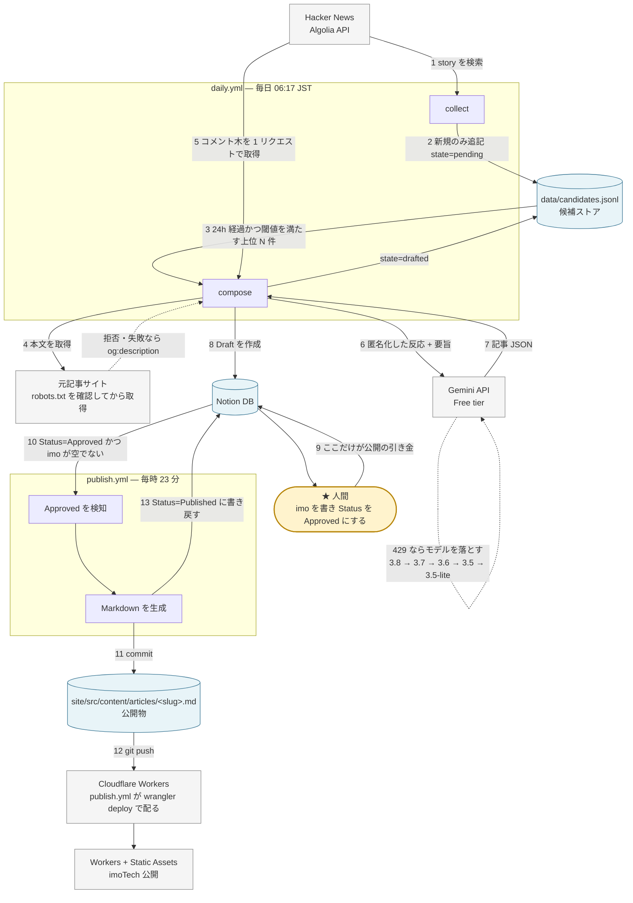

# imoTech 実装設計書

Hacker News や Qiita で話題になった技術記事を、日本語の「要旨 + 議論の論調 + imo」として公開する自動化パイプラインの設計。
用語は [CONTEXT.md](../CONTEXT.md) に従う。この文書は実装の設計だけを扱い、用語の定義はしない。

**前提の確定日**: 2026-09-21 / **調査した一次情報の確認日**: 同日

---

## 1. 全体像

### 1.1 データフロー



矢印の番号は処理の順序を表す。**9 番だけが人間の操作**で、他はすべて自動。
デプロイは `publish.yml` が `wrangler deploy` で行う（Workers Builds の Git 連携を使わない理由は 5.5 参照）。

### 1.2 ワークフローの分割

| ワークフロー | トリガー | 責務 | timeout |
|---|---|---|---|
| `daily.yml` | cron `17 21 * * *` (UTC) = 毎日 06:17 JST + `workflow_dispatch` | collect → compose | 40 分 |
| `publish.yml` | cron `23 * * * *` = 毎時 23 分 + `workflow_dispatch` | Approved 検知 → commit → ビルド → 成果物の検査 → `wrangler deploy` → Notion を Published に | 10 分 |
| `ci.yml` | `push` / `pull_request` | lint + test | 10 分 |

**毎正時を避ける理由**: 公式ドキュメントに「The `schedule` event can be delayed during periods of high loads of GitHub Actions workflow runs. High load times include the start of every hour. If the load is sufficiently high enough, some queued jobs may be dropped.」と明記されている（[events-that-trigger-workflows](https://docs.github.com/en/actions/reference/workflows-and-actions/events-that-trigger-workflows)）。分をずらしても drop の可能性は消えないため、**遅延・欠落を前提にした設計**（下記 5.5）にしている。

### 1.2b ローカル通し（Notion を使わない経路）

M2 の前に、外部アカウントを使わずに通しで動かす経路を用意した。M1 の完成後、
「生成物の行き先が無い」状態を解消するために入れたもので、**M2 を置き換えるものではない**。

```
collect → compose → site/src/content/articles/<slug>.md → Astro → localhost:4321
                         ↑ ここで止まり、人が imo を書くまで公開されない
```

Notion 運用との対応:

| Notion 経由（M2 以降） | ローカル通し（いま） |
|---|---|
| Draft を Notion に投入 | Markdown を `site/src/content/articles/` に書き出す |
| `imo` プロパティが空なら公開しない | 本文の `IMO_PLACEHOLDER` が残っていれば公開しない |
| 人が Status を Approved にする | 人がプレースホルダを自分の言葉に置き換える |
| `publish` が Markdown を commit | `compose` が直接書く。M3 以降は `daily.yml` が候補ストアと一緒に commit する |
| state を `drafted` にする | 同じ（Markdown を書けた時点で `drafted`） |

**公開の引き金を「人が何かを書くこと」に置いている点は同じ**。フラグを立てる方式にすると
立て忘れが起きるが、この方式なら書かないかぎり出ない。

`IMO_PLACEHOLDER` は `src/imotech/render.py` と `site/src/content.config.ts` の
両方に定義があり、ずれると「imo 未記入の記事が公開される」ため `tests/test_render.py` で突合している。

### 1.3 コンポーネントの責務と依存の向き

```
  cli.py  (collect / compose / publish のエントリポイント)
    │
    ├──▶ store.py        候補の永続化。jsonl の読み書きをここだけに閉じる
    ├──▶ sources/        話題と反応を拾う層。**ソースを足すときはここだけ触る**
    │      ├── __init__.py   StoryFeed / ReactionSource の Protocol
    │      ├── registry.py   名前 → 具象（Factory Method）
    │      ├── multi.py      複数ソースを 1 つに束ねる（Composite）
    │      ├── hackernews.py Algolia API の実装（Adapter を兼ねる）
    │      └── qiita.py      Qiita API v2 の実装（同上）
    ├──▶ links.py        外部サービスへのリンクの組み立て（はてブなど）
    ├──▶ extract.py      元記事本文の取得。robots.txt の判定を含む
    ├──▶ anonymize.py    反応から投稿者情報を落とす
    ├──▶ llm.py          Gemini 呼び出しとモデルフォールバック
    ├──▶ notion.py       Notion の投入・検知・更新
    └──▶ render.py       Draft → Markdown（フロントマター込み）
         │
         └──▶ models.py  すべてが依存する dataclass 群。他の何にも依存しない
```

**逆向きの参照を作らない**。`models.py` は他モジュールを import しない。
例外は**表示に使う文言の定数**で、`llm.py` と `notion.py` が `render.py` から
`IMO_PLACEHOLDER` / `USE_CASE_NOTE` を取る（文言を 1 か所に閉じるため。振る舞いは持ち込まない）。`notion.py` は `store.py` を知らない（呼び出し順は `cli.py` が決める）。`render.py` は Notion の API 形式を知らず、`models.Draft` だけを受け取る。

**採用したパターン**

`oo-design` の検討表を 1 行ずつ当てた結果。**GoF の実装形（クラス階層）をそのまま持ち込まず、
Python の標準的な書き方へ翻訳している**。

| パターン | どこ | 何を解いたか |
|---|---|---|
| **Repository** | `store.py` | 候補の永続化形式（jsonl）を 1 箇所に閉じる。将来 SQLite に替えても呼び出し側は変わらない |
| **Strategy** | `sources/__init__.py` | `StoryFeed` / `ReactionSource`。抽象基底クラスではなく **Protocol** で構造的に満たす。実装は差し替え可能 |
| **Factory Method** | `sources/registry.py` | 「どの具象を使うか」の分岐を 1 箇所に集める。クラス階層ではなく **「名前 → 生成関数」の辞書**に翻訳した |
| **Composite** | `sources/multi.py` | 複数ソースを 1 つの `StoryFeed` に見せる。**呼び出し側は 1 つか複数かを意識しない** |
| **Adapter** | 各ソースの `_story_from_*` | API の生の形（`objectID` / `created_at_i`）を `models` の型に変える。具象クラス自体が Adapter を兼ねる |

**見送ったパターンと理由**

| パターン | 見送った理由 |
|---|---|
| **Abstract Factory** | 作る対象が `StoryFeed` の 1 系統だけで、product family が無い。`ReactionSource` は同じオブジェクトが兼ねる |
| **Builder** | ソースの生成に多段の組み立てが無い。コンストラクタ引数で足りる |
| **Template Method** | 「HTTP で取る → パースする」の骨格は共通だが、**継承より合成**（`oo-design` の原則）。共通処理が要るなら HTTP クライアントを渡す形にする。いまは共通化するほどの重複が無い |
| **Decorator** | リトライとレート制限を重ねる余地はあるが、いまは `HackerNews._get` が内蔵している。外に出すと**モジュールが浅くなる** |
| **Facade** | `sources/__init__.py` が既に入口として働いている。追加の層は要らない |
| **Chain of Responsibility** | ステージ連鎖に分岐が無く、関数の直列呼び出しで読める |
| **State** | Status の遷移は「人間が 1 回 Approved にする」だけで、状態ごとの振る舞いの差が無い |
| **Observer** | 通知先は失敗時の Issue 起票だけで、宛先が増える見込みが無い |
| **Visitor** | 型による処理の分岐が無い |

**ソースを足すときに触る範囲**

1. `sources/<name>.py` を書く（`StoryFeed` を満たす。反応も取れるなら `ReactionSource` も）
2. `registry.py` の `_FACTORIES` に 1 行足す
3. **表示名と注目度の単位が要るなら** `site/src/lib/sources.ts` の `SOURCES` にも 1 行足す
   （無くても壊れないが、生のソース名と "points" が出る）

**Notion は触らない。** 列は意味ごとに 1 つで、`Source` の選択肢は最初のページを作ったときに
Notion が足す（3.1）。

`cli.py` も `store.py` も `render.py` も変えずに済むことは、`tests/test_sources.py` で
ダミーのソースを登録して実証している。

#### 2 つ目のソース（Qiita）で実際に何が起きたか

**上の 3 手順では済まなかった。** ただし増えた変更は「2 つ目だから」ではなく、
**Hacker News しか無かったあいだ気づけなかった暗黙の仮定**を剥がすためのもので、
3 つ目以降には持ち越さない。記録として残す。

| 剥がした仮定 | 直した場所 | なぜ Hacker News では見えなかったか |
|---|---|---|
| コメント ID は数値 | `models.Reaction.comment_id` を `str` へ | HN は数値。Qiita は 20 桁の 16 進 |
| 元記事の URL に投稿者名は入らない | `models.Story.author` を追加し、`anonymize` が伏せる | HN の元記事は第三者のブログ。Qiita は `qiita.com/<user_id>/items/<id>` |
| 話題には必ず議論が付く | `llm` / `render` / `notion` が**論調ゼロを許す** | → 2.3 / 2.4 / 2.5 |
| 「話題になった」の閾値は 1 組でよい | `Thresholds` と `pipeline.select` のソース別引き | → 4.1b |
| 収集時点で注目度が付いている | Qiita は収集時に絞らない（`fetch_stories`） | → 5.3b |
| プロンプトの「Hacker News」 | `prompts/compose.md` と `llm.build_user_prompt` | 単なる書き残し |

**3 つ目以降で触るのは、やはり上の 3 手順だけのはず。** 上の 6 行はいずれも
「ソースに固有の値」を持てる形に変えたもので、値は `sources/<name>.py` の中に置ける。

### 1.3c ソースごとに違う値をどこに置くか

ソースが増えると「ソースによって違う値」が出てくる（閾値、注目度の呼び名、
プロフィール URL の形）。**判定するコードは 1 つに保ち、値だけをソースが持つ。**

| 値 | どこが持つか | どこが使うか |
|---|---|---|
| 選別の閾値 | ソースの `default_thresholds`（`models.Thresholds`） | `pipeline.select`（→ 4.1） |
| プロフィール URL の形 | ソースの `profile_url_re` | `anonymize.scrub`（→ 5.4） |
| 投稿者のハンドル | `Story.author` | `anonymize`（→ 5.4） |
| 表示名・注目度の単位 | `site/src/lib/sources.ts` | サイトの表示 |

**`pipeline` は `sources` を知らない。** 候補が持つ `ref.source` を鍵にして辞書を引くだけで、
どのソースが実在するかも、その既定値が何かも知らない。値を束ねて渡すのは `cli` の仕事。

---

## 2. インターフェース仕様

### 2.1 候補ストア `data/candidates.jsonl`

1 行 1 候補の JSON Lines。**追記のみ**ではなく、状態更新時は全行を読み直して書き戻す（件数が数千行の規模では問題にならない）。

```json
{
  "url_hash": "3f9a1c7e2b8d4506",
  "source": "hackernews",
  "source_id": "41234567",
  "discussion_url": "https://news.ycombinator.com/item?id=41234567",
  "url": "https://example.com/posts/rust-async-split",
  "title": "The Rust async runtime split, one year later",
  "collected_at": "2026-09-21T21:17:04Z",
  "score_at_collect": 12,
  "comments_at_collect": 3,
  "state": "pending",
  "evaluated_at": null,
  "score_at_evaluate": null,
  "comments_at_evaluate": null,
  "notion_page_id": null,
  "skip_reason": null
}
```

| フィールド | 型 | 説明 |
|---|---|---|
| `url_hash` | string(16) | **冪等性キー**。正規化 URL の SHA-256 先頭 16 桁（2.2 参照） |
| `source` | string | 話題を拾ったソースの名前（`sources/registry.py` のキー） |
| `source_id` | string | ソース内で一意な ID。数値 ID のソースもあるので文字列で持つ |
| `discussion_url` | string | 反応が付いている場所。空なら未取得（旧形式の行がこれに当たる） |
| `url` | string | 元記事の URL（正規化**前**の原文。表示と取得に使う） |
| `title` | string | ソース上のタイトル |
| `collected_at` | RFC3339 | 収集時刻（UTC） |
| `score_at_collect` / `comments_at_collect` | int | 収集時点の値。熟成の伸び幅を見るために残す |
| `state` | enum | `pending` \| `drafted` \| `skipped` |
| `evaluated_at` | RFC3339 \| null | 熟成判定を行った時刻 |
| `score_at_evaluate` / `comments_at_evaluate` | int \| null | 判定時点の値。Notion に載せるのはこちら |
| `notion_page_id` | string \| null | 投入した Notion ページの id |
| `skip_reason` | string \| null | `below_threshold` \| `no_content` \| `llm_failed` \| `over_daily_limit` |

**state の遷移**: `pending` → `drafted`（Notion 投入成功）または `pending` → `skipped`（閾値未達・本文取得失敗・生成失敗）。`skipped` からは戻らない。

### 2.2 URL 正規化とハッシュ（冪等性の担保）

同じ記事が別の URL 表記で HN に複数回投稿されても 1 回しか書かないための仕組み。

```python
# src/imotech/urlhash.py の方針
TRACKING_PARAMS = {"utm_source","utm_medium","utm_campaign","utm_term","utm_content",
                   "ref","ref_src","fbclid","gclid","mc_cid","mc_eid","s","__twitter_impression"}

def normalize(url: str) -> str:
    # 1. scheme を https に固定（http/https の差を吸収）
    # 2. host を小文字化し、先頭の "www." を除去
    # 3. TRACKING_PARAMS を query から除去し、残りを key でソート
    # 4. fragment (#...) を除去
    # 5. path 末尾の "/" を除去（ただし path が "/" だけの場合は残す）

def url_hash(url: str) -> str:
    return hashlib.sha256(normalize(url).encode()).hexdigest()[:16]
```

**重複排除は 3 段構え**にする。1 つでも漏れると同じ記事を 2 回書くため。

1. `collect` 時: `candidates.jsonl` に同じ `url_hash` があればスキップ
2. `compose` 時: Notion を `URL Hash` プロパティで検索し、既存ページがあればスキップ
3. `publish` 時: `site/src/content/articles/` に同じ `slug` のファイルがあれば上書きせずスキップ（Notion 側の Status 更新だけ行う）

### 2.3 Gemini への入力（匿名化済み反応）

```
# システム指示（プロンプトの固定部分。src/imotech/prompts/ に置く）
あなたは日本語のテックメディアの編集者です。以下を読み、指定の JSON 形式で出力してください。
- 反応の原文をそのまま引用してはいけません。論点ごとに再構成してください。
- 反応の投稿者を特定しうる表現（ハンドル名、所属の推測）を書いてはいけません。
- 事実と意見を混ぜず、です・ます調で書いてください。

# ユーザー入力（動的部分）
## 元記事
タイトル: {title}
URL: {url}
本文（抜粋、最大 8000 文字）:
{article_text}

## {source} での反応（{n} 件、投稿者情報は削除済み）
スコア {score} / コメント {comments}

[C1] (返信 7 件, 階層 0) {body}
[C2] (返信 0 件, 階層 1) {body}
...
```

**ソース名は `Story.ref.source` から書く**（`hackernews` / `qiita`）。何の場での反応かで
読み方が変わるので名前は出すが、**表示名は持たせない** — ソースごとの呼び名を知るのは
表示層の責務で、`llm` はソースを知らない。

**反応が 1 件も無いときは、その旨を明示する。**

```
## {source} での反応
スコア {score} / コメント {comments}

**この記事には反応がありません。** `discourse` は出力しないでください。
```

明示しないと、モデルは元記事の内容を論点に見せかけて `discourse` を埋めてしまう。
スキーマからもフィールドごと外す（→ 2.4）。

**匿名化で落とすもの**: `by`（ハンドル名）、ユーザープロフィール URL、コメント本文中の `@username` 形式のメンション。
**残すもの**: 本文、`len(kids)`（直接の返信数）、ツリーの階層。
**残す理由**: HN の API はコメント単位の score を返さない（[HackerNews/API](https://github.com/HackerNews/API) の item に `score` があるのは story と pollopt のみ）ため、「どの意見が議論を呼んだか」を測れる唯一の手がかりが返信構造になる。

### 2.4 Gemini からの出力（構造化 JSON）

`response_mime_type: "application/json"` と `response_schema` を指定して、パース失敗を構造的に防ぐ。

```json
{
  "title": "Rust の非同期ランタイム分裂から1年、HN の争点は「互換性の約束」",
  "slug_hint": "rust-async-runtime-split-one-year",
  "digest": [
    "2025年に分裂した Rust の非同期ランタイム勢力図が、1年でどう変わったかを追った記事。",
    "筆者は tokio 以外の選択肢が実用段階に入ったとする一方、エコシステムの分断コストを指摘している。",
    "具体的には、ライブラリ側が複数ランタイムに対応するための抽象化レイヤの現状を比較している。"
  ],
  "discourse": [
    {
      "point": "互換レイヤは問題を先送りしているだけではないか",
      "detail": "最も返信を集めたのは、抽象化レイヤ自体が新たな依存になるという指摘でした。...",
      "stance": "critical"
    },
    {
      "point": "実運用ではランタイムを混ぜる場面がそもそも少ない",
      "detail": "...",
      "stance": "supportive"
    }
  ],
  "tags": ["rust", "async", "ecosystem"],
  "glossary": [
    { "term": "非同期ランタイム", "description": "..." }
  ],
  "use_cases": [
    { "scene": "既存のサービスを別ランタイムへ移したいとき", "detail": "..." }
  ]
}
```

| フィールド | 制約 |
|---|---|
| `title` | 日本語、**幅 25〜40**（全角 1・半角 0.5）。**事実を前に出す**（主体と行為で始め、先頭の幅 20 で核が分かる）。元記事の数字があれば入れる。争点は具体語で短く（反応が無ければ書かない）。「議論」「HN では」「記事が登場」、疑問符、`【】`、煽り語を使わない。答えを伏せない。反応の言葉は引用しない。幅が範囲外か決まった語・記号が入っていたら、`compose` が GitHub Actions の注釈（`::warning file=<記事>::`）を出す（`render.title_problems`。書き出しは止めない。曖昧さや語順は機械では見ない）。根拠は下の「タイトルの書き方」 |
| `slug_hint` | 英小文字・数字・ハイフンのみ。最終 slug は `YYYY-MM-DD-<slug_hint>` |
| `digest` | 3〜5 要素、各 60〜120 文字 |
| `discourse` | 2〜4 要素。`stance` は `supportive` \| `critical` \| `mixed` |
| `tags` | 2〜5 要素、英小文字 |
| `glossary` | **0〜5 要素**。`term` は記事に出てくる語（**分野は問わない**）、`description` は 30〜80 文字。`required` に入れず `minItems` も置かない — 用語が要らない記事で数を埋めさせないため |
| `use_cases` | **0〜3 要素**。`scene` は誰が何をしようとしているかが分かる場面（20〜40 文字）、`detail` は何にどう効くか（60〜120 文字）。`glossary` と同じく `required` にも `minItems` にも入れない |

**タイトルの書き方（2026-09-23 に改めた。それ以前の 12 本は 40〜60 字の旧形式のまま）**

「クリックされるような魅力的なタイトルになっていない」を受けて、よく読まれている日本語のテックサイトの実タイトルと、
見出しのガイドラインを調べて決めた。方向性（事実を前に出す型。まとめサイト型の煽りは採らない）はユーザーの判断。

| 決めたこと | 根拠 |
|---|---|
| 主体と行為で始める（「Google、〜を公開」） | ITmedia NEWS・Publickey の実タイトルの形（例: 「Anthropic、「Claude Opus 5.5」公開　…利用コスト4割減」）。Yahoo!ニュースの見出しの作法「大事なことを前に」（<https://news.yahoo.co.jp/newshack/inside/yahoonews_topics_heading.html>） |
| 幅 25〜40、先頭の幅 20 で核 | 調べた 9 サイトの中央値は 20〜56 字（多くは 28〜41 字）。Google は検索結果での表示字数を公式には示さず、デバイス幅で切る（<https://developers.google.com/search/docs/appearance/title-link>）ので、前に核を置く |
| 数字を入れる（作らない） | Chartbeat の見出しテスト（約 10 万件）で数字・what/where・引用が効き、疑問符は逆効果（<https://chartbeat.com/resources/research/infographics-the-enhanced-art-of-writing-headlines/>、ベンダーの自社データ） |
| 「議論」「HN では」の定型をやめる | 集めた 90 本余りに「議論」で終わるものは 0 本。どの記事にも付く定型句は Google がタイトルを書き換える理由になる（title-link のガイド） |
| 答えを伏せない・盛らない・煽らない | Google Discover（誇張と重要な情報を隠すことを避ける <https://developers.google.com/search/docs/appearance/google-discover>）、Meta（Withholding と Exaggerating を釣りとして配信を減らす <https://about.fb.com/news/2017/05/news-feed-fyi-new-updates-to-reduce-clickbait-headlines/>）、Yahoo!ニュース（煽り文句・海外を国内と誤解させる見出しを禁止 <https://news.yahoo.co.jp/info/articles-guidelines>） |
| 反応の言葉は引用しない | 既存の規則（反応の原文を引用しない、投稿者を特定しうる記述をしない）。@IT のような「生の声」の引用は、元記事の言葉に限る |

プロンプトの良い例・悪い例は**架空の社名・製品名・数字**にしてある。実在の記事を例にすると、同じ題材の記事で
例をそのまま写す（試し生成で起きた）うえ、例の数字が関係の無い記事に持ち込まれうる。

**生成 AI は長さの指示を守りきらない**（試し生成で幅 46 が出た）。止めると記事が 1 本も出なくなるので、
`compose` は外れたタイトルを注釈で知らせるだけにし、**人が記事 Markdown の title を直す**
（Notion の Title は読み戻さないので、Notion で直しても公開記事には効かない）。

**確かめていないこと:** 新しい形が実際にクリックされやすいかは測っていない（A/B テストの仕組みが無い）。


#### `use_cases` だけは「元記事に書かれていないこと」を含む

他のフィールドは**元記事と反応に書かれたことだけ**を扱う（`prompts/compose.md` の
「守ること」4・6）。`use_cases` はその**唯一の例外**で、「この技術は何に使えそうか」を
モデルに考えさせる。プロンプトの 4・6 に明示的な例外を書き、`use_cases` の指示にも
「他のフィールドでは引き続き禁止」と重ねて書いている。

**推測であることは表示層が示す。** `render.USE_CASE_NOTE` の但し書きを、公開記事と
Notion のレビュー面の両方に出す（文言は 1 か所に閉じる — 2 つで違うことが書いてあると
どちらが正か分からなくなる）。`site/src/pages/about.astro` の「何を機械がやり、
何を人間がやるか」の表にも 1 行足してある。

**0 件を許すのが要点。** 主張・意見の記事（「〜すべきだ」「〜は問題だ」）には使いどころが
無い。数を埋めさせると「AI なので幅広い用途に使えます」のような、元記事を読まなくても
書ける文が並ぶ。プロンプトで具体例つきに禁じている。

**反応が 1 件も無いときは `discourse` をスキーマから外す**（`llm.build_response_schema(with_discourse=False)`）。
`required` に残したまま「書くな」と指示しても、モデルは構造化出力の制約を満たそうとして
元記事の内容から論点を作ってしまう。**フィールドごと消すのが確実**。

記事プラットフォーム（Qiita など）では反応 0 件が普通で、実測では 82% がこれに当たる。

### 2.5 公開物の Markdown（`site/src/content/articles/<slug>.md`）

```markdown
---
title: "Rust の非同期ランタイム分裂から1年、HN の争点は「互換性の約束」"
publishedAt: 2026-09-22T09:00:00+09:00
sourceUrl: "https://example.com/posts/rust-async-split"
sourceTitle: "The Rust async runtime split, one year later"
source: "hackernews"
discussionUrl: "https://news.ycombinator.com/item?id=41234567"
hatenaUrl: "https://b.hatena.ne.jp/entry/s/example.com/posts/rust-async-split"
score: 342
comments: 187
tags: ["rust", "async", "ecosystem"]
model: "gemini-3.8-flash"
generatedAt: 2026-09-22T06:12:31Z
---

## 元記事の要旨

- ...

## 議論の論調

### 互換レイヤは問題を先送りしているだけではないか

...

## 使いどころ

（`render.USE_CASE_NOTE` の但し書き）

- **既存のサービスを別ランタイムへ移したいとき**: ...

## imo

（人間が書いた 1 行以上。空のあいだはプレースホルダが入り、公開されない）

## 用語

- **非同期ランタイム**: 非同期処理のスケジューリングを担う実行基盤。…
```

**用語は `imo` の後ろ**に置く。記事の締めは運営者の所感で、用語は付録として最後に読む。
`set_imo`（Notion の承認を差し込む処理）は「次の見出しまで」を imo 節として扱うので、
後ろに節を足しても壊れない。**用語が 0 件の記事では見出しごと出さない**（空の節を作らない）。
書式は `- **語**: 説明` に固定していて、`from_markdown` が同じ形で読み戻す。

**節の並びは 要旨 → 論調 → 使いどころ → imo → 用語。** 機械が書く部分をまとめ、
そのあとに運営者の imo が来る。用語だけ imo の後ろなのは、付録として最後に読むため。

**使いどころには但し書きが必ず付く**（`render.USE_CASE_NOTE`）。この節だけ元記事に
書かれていないことを含むので、断定的な提案として読まれないようにする（→ 2.4）。
0 件なら見出しごと出さない。

**反応が 1 件も無い記事は「議論の論調」の節を持たない。** 要旨 → 使いどころ → imo → 用語 の順になる。
空の見出しは作らない（`render.to_markdown` / `notion.build_blocks` の両方）。
`from_markdown` は論調節の無い Markdown も読み戻せる（往復で論調が生えない）。

出典と AI 利用の開示は**本文に入れない**。サイトのテンプレート（`site/src/pages/articles/[...slug].astro`）がフロントマターから描く。本文にも持たせると片方だけ古くなる。

`hatenaUrl` は `https://b.hatena.ne.jp/entry/s/` + 元記事 URL から scheme を除いたもの（https の場合）。**API は呼ばず、文字列として組み立てるだけ**。

### 2.6 アイキャッチ（OG 画像）

記事ごとの**タイトルカード**を、ビルド時に `dist/og/<slug>.png` として書き出す
（`site/src/pages/og/[slug].png.ts`）。記事ページの見出しの直下に出し、同じ画像を `og:image` にも使う。
**記事一覧（トップとタグ別）でもサムネイルとして使う**（M14。M11 の時点では一覧には出していなかった）。


| 項目 | 決めたこと | 根拠 |
|---|---|---|
| 中身 | サイト名 + 記事タイトル + ソース名と注目度（`Hacker News ・ 1098 points / 452 コメント`） | ユーザーの判断。注目度の書き方は記事ページの見出し下と揃える |
| 大きさ | 1200×630（1.91:1）、PNG | [Meta の推奨](https://developers.facebook.com/docs/sharing/webmasters/images)。1.91:1 に近いほどフィードで切り抜かれない |
| 描き方 | **Satori**（要素 → SVG）+ **Resvg**（SVG → PNG） | satori の作者側の参照実装 `@vercel/og` と同じ構成（[Vercel](https://vercel.com/docs/og-image-generation)） |
| フォント | Noto Sans CJK JP Bold の公式 OTF を同梱（`site/fonts/`） | fontsource（Google Fonts 版）では `𠮷髙﨑鷗①②③` が欠けた。出典とハッシュは `site/fonts/README.md` |
| タイトルの大きさ | 64 / 56 / 48 / 42 px から、**3 行に収まるいちばん大きい字**。42 px でも収まらなければ 4 行で省略記号 | 小さい字で押し込むより、SNS の縮小表示でも読める大きさを優先する |
| 行数の数え方 | **見積もらず、実際にレイアウトして数える**（`measureTitleLines`。高さを渡さずに組むと satori は中身の高さの SVG を返す。1 回 1〜2 ms） | 字数からの見積もりは、1 行の字数の端数と「英単語は途中で折り返さない」ことで外れた。既存記事の 1 本（52 字）が 3 行の見込みで 4 行になっていた |
| 長い英単語・URL | `wordBreak: "break-word"` | 指定が無いと、1 行より長い単語が画像の右端で切れる。`break-all` だとどの英単語も字の途中で切れる |
| 記事ページの `` | `alt=""`、`width` / `height` を明記 | 画像の文字は直上の見出しと同じで、読み上げると 2 回聞かせる（[WAI](https://www.w3.org/WAI/tutorials/images/decorative/)）。SNS 向けの代替テキストは `og:image:alt` に別に書く |

**採らなかったもの**

- **生成 AI の画像** — Gemini の画像生成は無料枠で使えない（[料金表](https://ai.google.dev/gemini-api/docs/pricing)で全モデル "Not available"）
- **元記事の og:image の流用** — 他人の画像の無断転載になる（はてブの OGP プレビューを「コメント本文が逐語で入り実質的な転載になる」として避けたのと同じ理由、`.scratch/pipeline/M5-monetization.md`）

**公開済みの記事だけに作る。** エンドポイントの `getStaticPaths` は記事ページと同じ
`publishedArticles()` を使う。未公開記事の画像を作ると、ページは生成されないのに画像だけが
公開され、**画像に描かれたタイトルから未公開記事の中身が漏れる**。
`site/scripts/check-unpublished.mjs` がこの漏れも成果物で確かめる。

**字の欠けはビルドを止めない。** フォントに無い字（絵文字など）は空白で描かれる。
1 記事のために全記事の公開が止まるほうが害が大きいので、警告をログに出すだけにしている。
既存記事のタイトルと落としやすい字は `site/src/lib/og-render.test.ts` が当てている。

**OGP のタグ**（`site/src/layouts/Base.astro`）

- `og:title` / `og:description` / `og:url` / `og:type` / `og:site_name` / `og:locale` は全ページに出す
  （これまで 1 つも無く、共有してもタイトルも画像も出なかった）
- `og:image` とその寸法・`og:image:alt` は、画像のあるページ（記事）だけ
- **`og:url` と `og:image` は絶対 URL**。`astro.config.mjs` の `site`（`SITE_URL`）から作る。
  SNS のクローラーは相対 URL を解決しない。`site/scripts/check-og.mjs` が成果物で確かめる
- X の `twitter:*` も**明示的に出す**。X の公式の仕様ページが消えていて（`docs.x.com` のトップへ転送）、
  og: へのフォールバックを一次情報で確かめられないため、頼らない

**ビルド時間**: 1 枚あたり約 0.3 秒（1 枚目は約 0.35〜0.5 秒（単独ビルドで実測。別のビルドが並行していると 0.7 秒前後まで延びた。CI の ubuntu では 0.13 秒））。
**公開記事の全件を毎回描き直す**ので、公開記事が約 1,500 本を超えると、公開ワークフローの
`timeout-minutes: 10` に近づく。そのときの手当て（差分だけ描く）は `.scratch/pipeline/M12-og-cache.md` に起票してある。
いまは素直に毎回描く（キャッシュの複雑さに見合う問題がまだ起きていない）。

**未公開漏れの検査は許可リスト方式**（`check-unpublished.mjs`）。`dist/og/` の下を全部数え、
公開記事の画像でないものが 1 つでもあれば落とす。「未公開記事の名前のファイルがあるか」を見るだけだと、
出力の場所が少しずれた（サブディレクトリ、ルートの形の変更）だけで漏れていても通ってしまう
（M11 のレビューで実際にすり抜けた）。

#### 一覧のサムネイル（M14）

（`site/src/components/ArticleEntry.astro`）

| 項目 | 決めたこと | 根拠 |
|---|---|---|
| 置き方 | 左にサムネイル（幅 11rem）、右にタイトルと日付。**幅 36rem 以下では画像をタイトルの上に**置く | ユーザーの判断。狭い画面で横に並べると字が細く折れる |
| 部品 | トップとタグ別一覧の両方が同じ部品を使う | ページごとに書くと片方だけ直して食い違う（タグ別一覧にも注目度が出るようになった） |
| 画像のリンク | `aria-hidden="true" tabindex="-1"` で**読み上げとキーボードから外す**。タイトルのリンクだけが残る | `alt=""` の画像だけのリンクは読み上げでリンク名が無くなる（[WAI](https://www.w3.org/WAI/tutorials/images/functional/)）。`tabindex="-1"` を併せて付けるのは、`aria-hidden` の中にフォーカスできる要素を残さないため（[axe の aria-hidden-focus](https://dequeuniversity.com/rules/axe/4.10/aria-hidden-focus) が成功例に挙げる形）。**画像とタイトルを 1 つのリンクで包む形（WAI が推奨する H2）も作れる**が、画像・タイトル・日付を別々のグリッド領域に置く今の構造を組み直すことになるので、今回は採らなかった |
| 読み込み | 先頭の 1 件は `eager` + `fetchpriority="high"`、2 件目以降は `lazy`。`width` / `height` を明記 | 画面外の画像を後回しにし、読み込み中のレイアウトのずれを防ぐ。狭い画面では先頭の画像が幅いっぱいに出て LCP になりやすい |
| 列と行 | 列は `11rem minmax(0, 1fr)`、行は `auto 1fr`。タイトルに `overflow-wrap: anywhere` | 列の最小幅を 0 にしないと、区切りの無い長い英単語で列が広がり、画像ごと画面の外へはみ出す。行を `auto 1fr` にしないと、サムネイルの方が背が高いとき日付の行がタイトルから離れる |
| 画像の大きさ | 1200×630 をそのまま縮めて使う（1 枚 45〜60 KB。タイトルが長いほど重い） | 一覧用の縮小版を別に作るほどの量ではない。**公開記事が 20 本を超えたら**縮小版（例: 440×231）を作る。横幅のある画面では 176px 幅で出すのに 1200px を読んでおり、遅延読み込みでも画面の近くの 14〜23 枚は先に読まれる（見積もり、M14 のレビュー） |

`site/scripts/check-og.mjs` が、一覧のサムネイルが**公開記事の実在する画像だけ**を指していること・寸法・
画像のリンクが外れていること・`loading` の出し分けを成果物で確かめる。**ページごとに項目の数も突き合わせる**
（部品の形が変わって 1 件も当たらなくなると、ほかの検査がすべて空振りしたまま成功で終わるため）。
未公開記事の slug がどのページの HTML にも出ていないことは `check-unpublished.mjs` が確かめる（許可リスト方式）。

---

## 3. Notion データベーススキーマ

### 3.0 API のバージョンとデータモデル（実装の前提）

| 事実 | 出典 |
|---|---|
| `Notion-Version` の現行値は **`2026-03-11`**。必須ヘッダで、欠けると 400 `missing_version` | [versioning](https://developers.notion.com/reference/versioning) |
| **`POST /v1/databases/{id}/query` は 2025-09-03 版で非推奨。** 代わりに `POST /v1/data_sources/{data_source_id}/query` を使う | [query-a-data-source](https://developers.notion.com/reference/query-a-data-source) |
| データモデルが変わり、**行とプロパティは database ではなく data source が持つ**。`data_source_id` は `GET /v1/databases/{database_id}` の `data_sources[0].id` から取る | [upgrade-guide-2025-09-03](https://developers.notion.com/guides/get-started/upgrade-guide-2025-09-03) |
| ページ作成の親は `{"data_source_id": ...}` | [post-page](https://developers.notion.com/reference/post-page) |
| DB 作成時のプロパティスキーマは `initial_data_source.properties` にネストする | [create-a-database](https://developers.notion.com/reference/create-a-database) |
| 1 クエリの上限は 10,000 件。到達すると `has_more: false` かつ `request_status.type == "incomplete"` | [query-a-data-source](https://developers.notion.com/reference/query-a-data-source) |

**古いバージョンを指定してはならない。** 動くが非推奨仕様のままになり、`data_source` を使う
新しい設計（ページ作成時の `data_source_id` など）が使えない。

### 3.0b Notion と Markdown の関係

**Notion は記事本文の正ではない。** 本文は `compose` が書いた Markdown が正で、
Notion からは**人が書いた imo だけ**を取り出す（`publish`）。

```
compose → Markdown を書く（## imo は空）
        → 同じ内容を Notion にも投入（imo プロパティは空）
人      → Notion で imo を書き、Status を Approved にする
publish → Notion から imo を読み、ローカルの Markdown に差し込む
        → Notion 側を Published にする
```

こうする理由は 2 つ。Notion のブロックから記事を再構成する複雑さを避けられること。
そして「正となるデータは Git」（Q2 の決定）を保てること。Notion が落ちても、
Notion の内容を消しても、公開済みの記事は影響を受けない。

**Notion を使わない運用も成立する。** `NOTION_TOKEN` と `NOTION_DATABASE_ID` が
揃っていなければ Notion の処理は黙って飛ばし、Markdown の `## imo` に直接書く運用になる。


### 3.1 プロパティ一覧

| プロパティ名 | 型 | 設定値 | 誰が書くか | 用途 |
|---|---|---|---|---|
| `Title` | Title | — | パイプライン | 記事タイトル（日本語） |
| `Status` | **Select** | `Draft` / `Approved` / `Published` / `Rejected` | 両方 | 状態。Approved にするのは人間だけ。imo が空の Approved は publish が Draft に差し戻す（3.2） |
| `imo` | Rich text | — | **人間のみ** | 所感。空のまま Approved にされたら公開しない（Draft に差し戻す） |
| `URL Hash` | Rich text | — | パイプライン | 冪等性キー。投入前の存在チェックに使う |
| `Slug` | Rich text | — | パイプライン | `YYYY-MM-DD-<slug_hint>` |
| `Source` | Select | 選択肢は書かない（下記） | パイプライン | 話題を拾ったソース（`hackernews` / `qiita` …）。`sources/registry.py` の名前 |
| `Source URL` | URL | — | パイプライン | 元記事 |
| `Discussion URL` | URL | — | パイプライン | 話題を拾ったソースでの議論（HN のスレッド、Qiita の記事） |
| `Score` | Number | 整数 | パイプライン | 熟成判定時の注目度（HN は points、Qiita は LGTM。単位は `Source` で読む） |
| `Comments` | Number | 整数 | パイプライン | 熟成判定時のコメント数 |
| `Tags` | Multi-select | — | パイプライン | タグ |
| `Collected At` | Date | 時刻を含む | パイプライン | 候補として拾った時刻 |
| `Published At` | Date | 時刻を含む | パイプライン | commit した時刻 |
| `Model` | Rich text | — | パイプライン | 実際に使われたモデル ID（フォールバックの記録） |

**列はソースごとに作らない（M8）。** 意味が同じ値（議論の URL・注目度・コメント数）はソースが違っても
同じ列に入れ、どのソースの行かは `Source` で分かるようにする。ソースを足すたびに列を足すと、
列が横に増え続け、ビューのフィルタや並べ替えもソースの数だけ要る。ソースに固有の指標
（Qiita のストック数など）は列にしない。要るならページ本文に書く。

**`Source` の選択肢はスキーマに書かない。** Select に無い名前でページを作ると、Notion がその名前を
選択肢に足す（「If the select data source property doesn't have an option by that name yet, then the name is
added to the data source schema」— [page-property-values](https://developers.notion.com/reference/page-property-values)）。
なので**ソースを足しても Notion 側の作業は要らない。**

**列の改名は `notion-setup` が行う。** `notion.py` の `RENAMED_PROPS`（旧名 → 新名）にある旧名の列が
同じ型で残っていれば、新しい列を足さずに改名する（`PATCH /v1/data_sources/{id}` でプロパティの `name` を変える —
[update-a-data-source](https://developers.notion.com/reference/update-a-data-source)）。足すと値の無い同じ意味の列が並び、
既存ページの値は旧名の列に取り残される。M8 で `HN URL` / `HN Score` / `HN Comments` をこれで改名し、
本番の 12 ページの値が前後で一致することを確かめた。旧名の列があるのに改名しないもの（型が違う、
新名の列が既にある）は、`notion-setup` が名指しで知らせる（黙って残すと値が旧名の列に取り残される）。

**改名前からあるページの `Source` は空欄になる。** Source は新しく作るページにしか書かない。
本番の 12 ページは M8 で一度きり埋めた（議論の URL のホストから判定）。

**戻すとき:** コードを戻す前に、Notion の UI で列名を旧名に戻す。先にコードだけ戻すと、旧コードの
`notion-setup` は旧名の列が無いと判断して空の列を足し、値が 2 つの列に分かれる。

**列にするのは、次のどれかに当たる値だけ。2・3 に当たっていても、他の列から作れる値は列にしない**
（1 は作れても残す。クエリで引くのに列が要る。`URL Hash` は `Source URL` から作れるが、1 に当たる）。

1. パイプラインが読み戻す — `Status` / `imo` / `URL Hash` / `Slug`
2. 表で絞り込み・並べ替えに使う — `Title` / `Source` / `Score` / `Comments` / `Tags` / `Collected At` / `Published At` / `Model`
3. 表から直接開きたいリンク — `Source URL` / `Discussion URL`

ページ本文に同じ情報があるかどうかは基準にしない（元記事の URL もモデル名も本文にあるが、表から開く・
絞り込むのに使う）。`Hatena URL` はこれで外した。`Source URL` から API なしで作れる
（`links.py` の `hatena_bookmark_url`）。
はてブのリンクはページ本文と、公開記事（Markdown の `hatenaUrl`）には引き続き出る。

**廃止した列は `notion-setup` が消さない。** `notion.py` の `RETIRED_PROPS` に載せ、既存の DB に残っていれば
名指しで知らせる。残しても動作に影響は無い（新しいページで空欄になるだけ）。消すかどうか・いつ消すかは人が決める。
**消すのは、廃止した版が main に push 済みで、実行中の daily.yml が無くなってから。** 先に消すと、
古いコードの `compose` がその列に書こうとして Notion への投入が失敗する。

**廃止を戻すとき:** README の「コードを更新したら」の順（push したら次の `daily.yml` より前に `notion-setup`）で、
空の列が足される。既存ページの値は埋まらない（埋める仕組みは無い。`Source URL` から
`links.py` の `hatena_bookmark_url` で作れる）。

**`Status` を Notion の Status 型ではなく Select 型にする理由**: Status 型のオプションは API から作成できず、Notion の UI で手作業になる。Select 型なら DB 作成スクリプトで完結し、環境の再現性が取れる。グループ機能（To-do / In progress / Complete）は今回の 4 状態には不要。

**`imo` をページ本文のブロックではなくプロパティにする理由**: API で確実に取得でき（本文ブロックの走査が不要）、「空のまま Approved」のバリデーションが 1 行で書ける。Notion のテーブルビューでも一覧できる。

### 3.2 ステータス遷移

```
                  ┌──────────────────────────────┐
                  │                              │ (人間が却下)
   [compose]      ▼                              │
  ─────────▶  ┌───────┐   人間が imo を書いて   ┌──────────┐
              │ Draft │──────────────────────▶ │ Approved │
              └───────┘        Approved に      └────┬─────┘
                  │                                  │
                  │ (人間が却下)                       │ [publish] が検知
                  ▼                                  │ Markdown を commit
             ┌──────────┐                            ▼
             │ Rejected │                      ┌───────────┐
             └──────────┘                      │ Published │
                                               └───────────┘
```

- `Draft` → `Approved`: **人間のみ**。これが公開の唯一の引き金
- `Approved` → `Published`: `publish` ワークフローが commit 成功後に書き戻す
- `Approved` → `Draft`（図には描いていない。図の上の線は人間の却下）: **imo が空（空白だけも含む）のまま Approved にされたページ**を、
  `publish` が差し戻し、**ページのコメントに理由を残す**（承認した人は Actions のログを見ないので、理由は
  Notion に置く）。公開はもともとしない（下の検知クエリと、空白を strip する判定で弾く）が、Approved のまま
  毎時黙って飛ばすと、承認した人は公開されない理由に気づけない
  - 先に Approved にしてから imo を書く人もいるので、**最後の編集から 30 分**（`cli.py` の
    `BLANK_APPROVAL_GRACE`）経っていないページは次回に回す。書き込む直前にページを読み直し、imo が
    入っていたら差し戻さない
  - Markdown の `## imo` に直接書いた記事（Notion の imo は空）は差し戻さず、`Published` に進める
  - **副作用:** 差し戻されたことに気づかず、Draft のまま imo を書いたページは公開されない
    （`fetch_approved` は Approved しか引かない）。コメントがその手がかりになる
  - Markdown の imo にプレースホルダのコメント行が残っている記事は、差し戻さずに `[warn]` を出す
    （「imo が空」と差し戻すと、本人は書いたつもりなので本当の原因に気づけない）
  - 差し戻しの失敗（Notion の 429 / 5xx など）で publish は止めない。`[warn]` を出して次回また見る
  - コメントの投稿は、応答がタイムアウトしたときに再試行するので、まれに同じコメントが 2 つ付く（許容する）
- `Draft` / `Approved` → `Rejected`: 人間が却下。パイプラインは二度と触らない
- `Published` から先に遷移はない。記事を直したいときは Markdown を直接編集する（Git が正）

**`Approved` の検知クエリ**（Notion API の制約への対処）:

```json
{
  "filter": {
    "and": [
      { "property": "Status", "select": { "equals": "Approved" } },
      { "property": "imo", "rich_text": { "is_not_empty": true } }
    ]
  }
}
```

`last_edited_time` はページ単位でしか取れず「Status が変わった瞬間」を検知できない（[filter リファレンス](https://developers.notion.com/reference/post-database-query-filter)）。そこで**時刻ではなく状態そのものを引く**。`Approved` は publish が処理したら即 `Published` に変わるため、このクエリは常に「未処理の承認」だけを返す。時刻比較が不要になり、ワークフローが遅延・欠落しても取りこぼさない
（時刻を見るのは、imo が空の承認を差し戻すかどうかの猶予の判定だけ。公開の検知には使わない）。

`imo` の空チェックをクエリに含めることで、書き忘れたまま Approved にした記事が公開されるのを仕組みで防ぐ。

### 3.3 ページ本文のブロック構造

```
callout   ⚠️ 公開するには、右の imo プロパティに一言書いてから Status を Approved にしてください
heading_2 元記事の要旨
bulleted_list_item × 3〜5
heading_2 議論の論調
  heading_3 <論点1>
  paragraph <detail>
  heading_3 <論点2>
  paragraph <detail>
divider
heading_2 出典
bulleted_list_item 元記事: <Source URL>
bulleted_list_item 議論: <Discussion URL>
bulleted_list_item はてなブックマーク: <はてブのコメントページ（Source URL から組み立てる）>
paragraph 生成モデル: <model> / 生成日時: <generatedAt>
```

**ブロックの分割投入**: Notion API は 1 リクエストあたり **1,000 ブロック / 500 KB / 配列 100 要素**が上限（[request-limits](https://developers.notion.com/reference/request-limits)）。記事 1 本は 20 ブロック前後で収まるが、`children` 配列は 100 要素上限があるため、**100 件ずつに分割して `PATCH /v1/blocks/{id}/children` で追記する**実装にする。

**rich_text の 2,000 文字上限**: `detail` が長い場合に備え、2,000 文字を超えたら段落を分割する。

---

## 4. 熟成と選別

### 4.1 判定ロジック

```python
# src/imotech/config.py（すべて環境変数で上書き可能にする）
MATURATION_HOURS = 24  # 収集からこの時間が経った候補だけを評価する
MIN_SCORE = 100  # HN の points 下限
MIN_COMMENTS = 30  # コメント数の下限
MAX_DRAFTS_PER_RUN = 10  # 1 回の実行で作る下書きの上限（2026-09-24 に 5 から増やした。ユーザーの判断）
MAX_AGE_HOURS = 96  # これを過ぎた pending は skipped(below_threshold) にする
```

```
compose の処理順:
  1. candidates.jsonl から state == "pending" を読む
  2. collected_at + MATURATION_HOURS <= now のものだけ残す
  3. Algolia で現在の points / comments を取り直す（収集時の値ではなく現在値で判定）
  4. points >= MIN_SCORE かつ comments >= MIN_COMMENTS を満たすものを残す
  5. 話題に当たる候補を先、その中は points の降順に並べ、上位 MAX_DRAFTS_PER_RUN 件だけ処理する（4.1c）
  6. 残った候補のうち collected_at + MAX_AGE_HOURS を過ぎたものは skipped にする
     （それ以外は pending のまま翌日に持ち越す）
```

**閾値を満たす候補が 0 件の日は、記事を 1 本も作らない**。これは意図した挙動で、AdSense の Publisher Policies が広告を許さないとしている "low-value content" / "embedded or copied content from others without additional commentary, curation, or otherwise adding value"（[Publisher Policies](https://support.google.com/adsense/answer/9335564)）を避けるための設計判断。更新頻度より 1 本あたりの密度を取る。

**現在値で判定する理由**: 収集時点のスコアは「まだ誰も反応していない」段階の値で、熟成の判定に使えない。Algolia の `/api/v1/items/<id>` は 1 リクエストでコメント木ごと取れるため、判定と反応取得を同じレスポンスで済ませられる。

### 4.1c 話題で優先する

「AI・クラウド・言語・ガジェット/IT ニュースの記事をもっと」を受けて（2026-09-24、ユーザーの判断）、
閾値を満たす候補のうち**話題に当たるものを先に記事にする**。当たらない候補は捨てず、当たる候補が
`MAX_DRAFTS_PER_RUN` に足りない日の穴埋めに使う（0 本の日を作らない）。

| 決めたこと | 理由 |
|---|---|
| 話題の語は `src/imotech/topics.toml`（`IMOTECH_TOPICS_PATH` で差し替え） | 語は運用で増減する。コードを触らずに直せるように |
| タイトルと URL のホスト名だけで判定する | 本文を取る前（候補の段階）に決める必要がある。`openai.com` のような発信元もホスト名で当たる |
| 英数字の語は語の境界で当てる（後ろの数字は許す: "GPT5" "Qwen3"）。日本語は部分一致。全角は NFKC で半角にそろえる | "ai" が "said" に、"mac" が "machine" に当たらないように。普通の英単語と重なる語は 2 語にして絞る（"react" → "react native"、"galaxy" → "samsung galaxy"、"agents" → "ai agents"）。"meta" "chip" "tesla" は外した |
| **問い合わせ（現在値の取り直し）も話題の候補を先にする。ただし枠の 25% は話題外に残す**（`pipeline.probe_targets`） | 問い合わせは `MAX_PROBES_PER_RUN` 件まで。収集時スコアの上位だけにすると、スコアの低い話題の候補は現在値が無く選べない。逆に全部を話題に回すと、話題外の候補は一度も現在値を取られないまま期限切れで打ち切られ、穴埋めが起きない（話題の候補は本番で 102/281 件あり、枠 40 件を常に埋める。2026-09-24 の dry-run）。どちらかが余ればもう一方に回す |
| 閾値は変えない | 質を落とさずに話題を寄せる。HN は閾値を満たす候補が十分ある（`stats` で 84%） |

1 日の本数は 5 → 10 に増やした（**人が imo を書く対象も 1 日 10 本に増える**。imo が空の記事は公開されない）。
戻すときは `daily.yml` の `env` に `IMOTECH_MAX_DRAFTS_PER_RUN: "5"` を足す。Gemini の無料枠の 1 日の上限（RPD）は公式ドキュメントに数値が無く、
AI Studio でしか見えない（<https://ai.google.dev/gemini-api/docs/rate-limits>）。上限に当たっても、
生成に失敗した候補は pending のまま翌日に回る。**1 日の上限による 429 は同じモデルで再試行せず、
次のモデルへ移り、その実行のあいだは以降の候補でもそのモデルを飛ばす**（その日のうちは戻らない <https://ai.google.dev/gemini-api/docs/api-errors>）。
429 が 1 日の上限かどうかは、応答の quotaId に "PerDay" が入るかで見ている（この形は未確認）。

### 4.1b 閾値はソースごとに違う

`models.Thresholds`（`min_score` + `min_comments`）で表し、`pipeline.select` が
候補の `ref.source` で引く。**判定するのは `pipeline` だけ**で、`Thresholds` は値しか持たない。

**なぜ 1 組では足りないか。** Hacker News は議論そのものが目的の場なのでコメントが数百付くが、
記事プラットフォームではほぼ付かない。Qiita の実測（2026-09-23、`created:>=2026-09-16
stocks:>3` で取得した 56 件）では **0 件が 46 件（82%）、最多でも 9 件**だった。
共通の `min_comments=30` を当てると Qiita は 1 件も通らない。

決め方は上から順に見て、決まった時点で採用する。

| 優先 | どこ | 例 |
|---|---|---|
| 1 | `IMOTECH_SOURCE_THRESHOLDS`（JSON） | `{"qiita": {"min_score": 50, "min_comments": 0}}` |
| 2 | ソース自身の `default_thresholds` | `Qiita.default_thresholds = Thresholds(30, 0)` |
| 3 | 共通の `IMOTECH_MIN_SCORE` / `IMOTECH_MIN_COMMENTS` | `Thresholds(100, 30)` |

**Hacker News はあえて 2 を持たない。** 共通設定が Hacker News の値そのものなので、
持たせずに 3 へ倒すことで `IMOTECH_MIN_SCORE` が従来どおり効く（後方互換）。

**設定ミスは黙って無視せず落とす。** 壊れた JSON、知らないソース名、知らない項目名の
いずれも `ValueError` にして起動時（`cli._dispatch`）で止める。握り潰すと、意図した数と
違う記事が出続けても無人実行では気づけない。**外部への問い合わせより前に落とす**のは、
Qiita なら非認証 1 時間分のレート予算を捨ててから落ちることになるため。

### 4.2 閾値の初期値の根拠と調整

`MIN_SCORE = 100` / `MIN_COMMENTS = 30` は**運用しながら調整する前提の初期値**であり、一次情報に基づく値ではない。HN の front page 到達ラインは時間帯とその日の投稿量で変動するため、固定値の正解は存在しない。

**調整の手順**: 運用 2 週間後に `candidates.jsonl` を集計し、`MAX_DRAFTS_PER_RUN` に対して候補が常に余る（＝閾値が緩い）か、0 件の日が続く（＝厳しい）かを見て動かす。この集計は `uv run imotech stats` で出せる（M1 で実装済み）。

---

## 5. エラーハンドリングとレート制限

### 5.1 Gemini API

**モデルフォールバック**（Q8 の決定）:

```python
MODEL_CHAIN = [
    "gemini-3.8-flash",
    "gemini-3.7-flash",
    "gemini-3.6-flash",
    "gemini-3.5-flash",
    "gemini-3.5-flash-lite",
]
```

```
1 記事の生成:
  for model in MODEL_CHAIN:
      for attempt in 1..3:
          try: return generate(model, prompt)
          except RateLimited (429):
              if attempt < 3: sleep(2 ** attempt)  # 2s, 4s
              else: break  # 次のモデルへ
          except ServerError (5xx):
              if attempt < 3: sleep(2 ** attempt)
              else: break
          except InvalidResponse:  # JSON schema 不一致
              if attempt < 3: continue  # 同じモデルで再試行
              else: break
  # 全モデルで失敗 → その候補を pending のまま残し、失敗を記録して次の候補へ
```

**スロットリング**: 記事間に固定 6 秒の sleep を入れる。10 本でも合計 60 秒。timeout は 1 本あたり 1〜1.5 分（M1 の実測は 5 本で 7.3 分）と問い合わせの予算（最大 5 分）を見て 40 分にしてある。

**RPD/RPM の公称値は確認できない**: Google は[レート制限の数値を公式ドキュメントから削除](https://ai.google.dev/gemini-api/docs/rate-limits)し（"Rate limits ... can be viewed in Google AI Studio"）、AI Studio のログイン後ページでしか公開していない。さらに**この環境では組織の管理者が AI Studio を無効化**しており、そのページも開けない。

**代わりに実ワークロードで実測した（2026-09-21）**。1 日分（5 本）を流した結果:

| 指標 | 実測 |
|---|---|
| 429（レート制限） | **0 件** |
| 503（一時的な不可用） | **20 件**（3.8=8 / 3.7=6 / 3.6=6） |
| 生成成功 | 3 件（うち 2 件は 10 回目の試行で成功） |

**無料枠は「枠」ではなく「空き」で律速されている**（5 本/日の時点の実測）。2026-09-24 に 10 本/日へ増やした（4.1c）。
10 本での所要時間と、1 日の上限（RPD）に当たるかは**未実測**。一部の候補が生成に失敗した日は、`compose` が
`::warning` を実行の概要に出す（終了コードは 0）。毎日続くなら `IMOTECH_MAX_DRAFTS_PER_RUN` を下げる。一方で**モデルフォールバックが無いと成立しない**（2 件は 3.8 → 3.7 → 3.6 → 3.5 と落ちてようやく通った）。鎖を短くしてはならない。

**匿名化の強制**: `llm.py` は `anonymize.py` を通していない生の反応を受け取れない型にする（`AnonymizedReaction` 型を引数に取る）。無料枠は[規約](https://ai.google.dev/gemini-api/terms)に "human reviewers may read, annotate, and process your API input and output... Do not submit sensitive, confidential, or personal information to the Unpaid Services." とあるため、PII の送信を実装レベルで防ぐ。

**Amazon 関連情報を Gemini に渡さない**: Amazon アソシエイトのポリシーに「プログラム・コンテンツから作成したAI生成コンテンツを...大規模言語モデル...を開発または改善するために使用しない」とあり、無料枠は入力が学習に使われる。アフィリエイトの商品情報は Gemini のプロンプトに一切含めない。

### 5.2 Notion API

| 事象 | 対処 |
|---|---|
| 429 | レスポンスの `Retry-After` ヘッダ（および body の `additional_data.retry_after`）を尊重して待つ。最大 3 回 |
| 5xx / 529 | 指数バックオフで**最大 3 回試行**。待ちは 1 回目の失敗後 1 秒、2 回目の失敗後 2 秒（3 回目が失敗した時点で諦めるので 4 秒待ちには到達しない）。`IMOTECH_NOTION_MAX_ATTEMPTS=4` にすれば 4 秒待ちも入る |
| 通常時 | リクエスト間に **350 ms** の間隔を入れる（Free/Plus は 180 req/min = 平均 3 req/sec、[request-limits](https://developers.notion.com/reference/request-limits)） |
| 403 `restricted_resource` + `block_limit` | ワークスペースのブロック上限。**1 人ワークスペースなら無制限**なので、これが出たら「2 人目を招待した」のサイン。Issue のメッセージにこの注意書きを含める |

**Notion ワークスペースは 1 人で運用すること。** Free プランは 2 人目のメンバーを入れた瞬間に生涯 1,000 ブロック上限がかかり、API も 403 を返してパイプラインが停止する（[workspace-block-limits](https://developers.notion.com/reference/workspace-block-limits)）。共同編集が必要になったらゲスト招待（10 人まで）で回避する。

### 5.3 Hacker News

| 事象 | 対処 |
|---|---|
| 取得方法 | **Algolia の `/api/v1/items/<id>`** を使い、コメント木を 1 リクエストで取る。Firebase API で `kids` を再帰的に辿ると 1 記事で数百リクエストになるため使わない |
| レート制限 | Algolia は 10,000 req/h（[hn.algolia.com/api](https://hn.algolia.com/api)）。1 日 5〜30 リクエスト程度なので余裕 |
| 5xx / タイムアウト | 指数バックオフ 3 回。全滅したらその候補を pending のまま翌日へ |
| 欠損フィールド | `points` / `num_comments` / `url` が `null` のことがある（Ask HN など URL を持たない投稿）。**`url` が null の story は collect の段階で除外する**（元記事が存在しないため） |
| 削除されたコメント | `text` が null の要素はスキップする |

**収集クエリ**:
```
GET https://hn.algolia.com/api/v1/search_by_date
      ?tags=story
      &numericFilters=created_at_i>{24時間前のunixtime},points>{COLLECT_MIN_SCORE}
      &hitsPerPage=50
```
`COLLECT_MIN_SCORE` は熟成前の粗いフィルタ（初期値 10）。ここを 0 にすると 1 日数千件が候補に入り jsonl が肥大化する。

### 5.3b Qiita

Hacker News と性格が大きく違い、**レート制限が実運用の天井になる**。

| 事象 | 対処 |
|---|---|
| レート制限 | **非認証 60 req/h/IP**、認証 1000 req/h（[API v2 docs](https://qiita.com/api/v2/docs)）。`Rate-Limit` / `Rate-Remaining` / `Rate-Reset` ヘッダが返る |
| **超過時の応答** | **429 ではなく 403 + `{"type": "rate_limit_exceeded"}`**（実測）。403 は権限エラーでもあるので、本文の `type` で見分ける |
| 超過したら | **リトライしない**（時間単位のリセットなので数秒待っても回復しない）。以降のリクエストも送らず、候補は pending のまま次回へ。警告は 1 回だけ、`Rate-Reset` から回復時刻を添えて出す |
| 4xx | **リトライしない**。削除済み記事（404）は待っても変わらないのに 1 件で 3 リクエスト食う |
| 5xx / タイムアウト | 指数バックオフ 3 回（Hacker News と同じ） |
| リクエスト数の節約 | **`comments_count` が 0 なら `/comments` を呼ばない**。実測で 82% がこれに当たるので、1 候補あたり 2 → 1 リクエストになる |
| **取得失敗と 0 件の区別** | `/items/:id` は成功したが `/comments` が失敗した場合、**`(None, [])` を返して判定不能にする**。`[]` を返すと議論のある記事が「反応なし」として確定的に書き出され、候補が drafted になって二度と作り直されない |

**収集クエリ**:
```
GET https://qiita.com/api/v2/items
      ?page=1&per_page=100
      &query=created:>={(window_hours の 1 日前)} stocks:>0
```

**`min_points` を収集時に使わない。** Qiita の記事は投稿直後に LGTM が付かない
（実測: 直近 24 時間の記事は最大 6 LGTM）。収集時の値で切ると候補が 1 件も残らないので、
母数だけ絞って熟成後の再評価に任せる。Hacker News は投稿直後から points が伸びるので、
あちらは収集時に切っている。

**`created:` は日付単位**なので 1 日広く問い合わせ、時刻での足切りは手元で行う。
ページを追う間に新着が入るとオフセットがずれるため、`ref.id` で重複を除く。

**運用上の天井**: `IMOTECH_MAX_PROBES_PER_RUN`（既定 60）と collect の検索（最大 3 ページ）が
同じ 60 req/h を食う。**Qiita を有効にするなら 40 以下に下げる**。GitHub Actions の IP は
他の利用者と共有するため、自分が使っていなくても枯れていることがある。

### 5.4 元記事の本文取得

```
1. urllib.robotparser で {origin}/robots.txt を取得し、can_fetch(USER_AGENT, url) を判定
   - robots.txt が 404 / 取得失敗 → 「許可」として扱う（RFC 9309 の既定に沿う）
   - robots.txt が 5xx → 「不許可」として扱い、OGP にフォールバック
2. 許可された場合のみ GET
   - User-Agent: "imoTechBot/1.0 (+https://<domain>/about)"
   - timeout=10s, リダイレクト最大 5 回, レスポンス上限 5 MB, Content-Type が text/html 以外は中断
3. trafilatura で本文抽出 → 8,000 文字で切る
4. 抽出失敗 or 不許可 → <meta property="og:description"> にフォールバック
5. それも取れない → その候補を skipped(no_content) にする
```

**本文は Gemini への入力にのみ使い、記事には転載しない。** 公開物に載るのは Gemini が生成した日本語の要旨だけ。

`robots.txt` の判定は標準ライブラリの `urllib.robotparser` を使う（自作しない）。

### 5.5 GitHub Actions

| 事象 | 対処 |
|---|---|
| ジョブ失敗 | `if: failure()` で `.github/actions/notify-failure`（composite action）を呼ぶ。**同じラベル `pipeline-failure` の open issue があればコメント追記**して乱立を防ぐ。`publish.yml` からも同じ action を使う |
| 失敗しても exit 0 で終わる | `if: failure()` はステップの終了コードしか見ない。`compose` は Gemini の失敗も Notion の 403 も捕まえて続行するため、**そのままでは全滅しても 0 で終わる**。そこで「人が直すまで回復しない失敗」＝ **生成が全滅して記事化 0 件**／**Notion 投入が全滅**のときだけ非 0 を返す（`src/imotech/cli.py` の `cmd_compose` 末尾）。部分的な失敗は 0 のまま — pending に残り次回が拾うので、1 件ごとに Issue が立つと通知が意味を失う |
| schedule の遅延・drop | 状態を時刻ではなく `state` / `Status` で持っているため、1 回飛んでも次回が拾う。`MAX_AGE_HOURS=96` があるので、3 回連続で飛んでも取りこぼさない。**実測（2026-09-22）: `publish.yml` は 9 回走るはずの時間帯で 1 回しか走らなかった。** drop は例外ではなく常態と考えるべきで、急ぐときは `gh workflow run` を手で叩く |
| 60 日無活動での自動停止 | **`daily.yml` が毎日 `candidates.jsonl` を commit するため、無活動状態にならない**（public repo の schedule は「no repository activity in 60 days」で停止する。[docs](https://docs.github.com/en/actions/reference/workflows-and-actions/events-that-trigger-workflows)） |
| ワークフローの多重実行 | `concurrency: { group: <workflow>, cancel-in-progress: false }` |
| commit の競合 | push 前に `git pull --rebase origin main`。`daily.yml` は `data/candidates.jsonl` と **`site/src/content/articles/` の新規ファイル**、`publish.yml` は既存記事の `## imo` を書き換える。同じ記事ファイルに同時に当たらない限り rebase で解決でき、当たった場合はジョブが失敗して Issue が立つ |
| timeout / キャンセルで通知が出ない | `if: failure()` は timeout（`timeout-minutes` 到達）や手動キャンセルでは真にならない。`if: ${{ failure() \|\| cancelled() }}` で両方を拾う（[expressions](https://docs.github.com/en/actions/reference/workflows-and-actions/expressions) の `cancelled()` は「ワークフローがキャンセルされたら true」） |
| 通知が 2 本立つ | `daily.yml` と `publish.yml` がほぼ同時に失敗すると、双方が open issue を見つけられず Issue が 2 本立つ。GitHub API に「無ければ作る」の原子操作が無いので避けられない。**実害は Issue 2 本なので許容する** |
| 自動 commit に CI が当たらない | `GITHUB_TOKEN` による push は新しいワークフロー実行を作らない（[公式](https://docs.github.com/en/actions/how-tos/write-workflows/choose-when-workflows-run/trigger-a-workflow)。再帰実行の防止）。`ci.yml` の公開ゲート検証は自動 commit をすり抜けるが、公開の可否を決めるのはサイト側のゲート（`site/src/lib/imo.ts`）なので、未記入記事の漏洩には至らない |
| 失敗通知が届かない | 公式の通知は「自分がトリガーした実行」が対象で、schedule はワークフロー作成者に飛ぶ。cron を編集すると通知先が移る（[notifications](https://docs.github.com/en/actions/concepts/workflows-and-actions/notifications-for-workflow-runs)）。**Issue 起票を一次の通知手段とし、メール通知には依存しない** |

**Secrets**（すべて GitHub Secrets に登録。public repo でもログには出ない）:

| 名前 | 用途 | 取得元 |
|---|---|---|
| `GEMINI_API_KEY` | Gemini API | Google AI Studio |
| `NOTION_TOKEN` | Notion 内部インテグレーション | Notion の Integrations 画面 |
| `NOTION_DATABASE_ID` | 対象 DB | Notion の DB URL |
| `GITHUB_TOKEN` | commit / issue 起票 / 失敗ステップの特定 | Actions が自動発行（`permissions: {contents: write, issues: write, actions: read}` を宣言。`actions: read` は `gh run view --json jobs` が実行の記録を読むために必要） |
| `CLOUDFLARE_API_TOKEN` | `wrangler deploy` | Cloudflare の Account API tokens で「Edit Cloudflare Workers」テンプレートから発行 |
| `CLOUDFLARE_ACCOUNT_ID` | 同上 | Cloudflare ダッシュボード |

**Variables**（secret ではない。値が見えてよいもの）:

| 名前 | 用途 |
|---|---|
| `SITE_URL` | `astro build` が sitemap と RSS に焼き込む絶対 URL。現在は `https://imotech.higashi-kaijin.workers.dev` |

**デプロイは Actions から `wrangler deploy` を叩く。** Workers Builds の Git 連携ではなく、
`publish.yml` の中でビルドしてデプロイする。理由は 3 つ。

1. **失敗を検知できる。** Git 連携だと Cloudflare 側でビルドが落ちても Actions は成功するので
   Issue が立たず、サイトが何日も古いままになる（気づく手段はダッシュボードだけ）
2. **Cloudflare のビルド枠を使わない。** Free は月 500 ビルド・同時 1 ビルドで、
   **Workers Builds にパスフィルタは無い**（[configuration](https://developers.cloudflare.com/workers/ci-cd/builds/configuration/)
   の設定項目は Git アカウント・リポジトリ・ブランチ・ビルドコマンド・デプロイコマンド・
   ルートディレクトリ・ビルド変数だけ）。`candidates.jsonl` だけの commit でもビルドが走る
3. **`SITE_URL` の設定漏れが起きない。** Actions の `env` で渡せる

使うのは公式アクション `cloudflare/wrangler-action@v4`
（[github-actions](https://developers.cloudflare.com/workers/ci-cd/external-cicd/github-actions/)）。
`GITHUB_TOKEN` による push は他のワークフローを起動しないため、デプロイは
**`publish.yml` と同じジョブの中**に置く（別ワークフローに切り出すと走らない）。

**デプロイの直前に、CI と同じ成果物の検査を流す**（`check-unpublished.mjs` と `check-og.mjs`）。
同じ理由で、`publish.yml` が commit した記事は CI を起動しない。ここで見ないと、承認で公開されるたびの
成果物は検査されないまま配られる。検査が落ちたらデプロイも Notion の更新もしない
（Markdown は main に入っているので、直して `gh workflow run publish.yml` で再実行する）。

`daily.yml` はデプロイしない。`compose` が書く記事は `imo` 未記入で、サイト側のゲートが
公開から外すため、公開物は変わらない。

### 5.6 「RSS のフォーマット差異」について（元の要件からの変更点）

当初の要件には「取得元 RSS のフォーマット差異や取得失敗時のフォールバック処理」が含まれていたが、**設計の結果 RSS を使わない**ことになった（情報源が Hacker News の API 単独）。RSS 特有の差異（RSS 2.0 / Atom / 日付フォーマットの揺れ / CDATA）への対処は不要になる。

将来 RSS ソースを足す場合に備え、`sources/` の `StoryFeed` Protocol は「フィードの形式を知らない」インターフェース（`fetch_stories() -> list[Story]`）にしてある。RSS 実装を足すときは `sources/rss.py` に閉じ、`feedparser` で形式差を吸収する。

---

## 6. ディレクトリ構成

```
imoTech/
├── CONTEXT.md                     用語集（実装の詳細は書かない）
├── README.md                      セットアップと運用手順
├── .gitignore
├── .env.example                   必要な環境変数の一覧（値は空）
├── pyproject.toml                 uv
├── uv.lock
├── docs/
│   └── DESIGN.md                  この文書
├── .scratch/
│   └── pipeline/                  マイルストーンのチケット
├── data/
│   └── candidates.jsonl           候補ストア（Git 管理。空ファイルで初期化）
├── src/
│   └── imotech/
│       ├── __init__.py
│       ├── cli.py                 collect / compose / publish / stats
│       ├── config.py              閾値・モデル一覧・環境変数の読み込み
│       ├── models.py              Story / Candidate / Reaction / Draft の dataclass
│       ├── urlhash.py             URL 正規化とハッシュ
│       ├── links.py               外部サービスへのリンクの組み立て（はてブなど）
│       ├── sources/               話題と反応を拾う層。ソースを足すときはここだけ
│       │   ├── __init__.py        StoryFeed / ReactionSource の Protocol
│       │   ├── registry.py        名前 → 具象（Factory Method）
│       │   ├── multi.py           複数ソースを束ねる（Composite）
│       │   ├── hackernews.py      Algolia API の実装
│       │   └── qiita.py           Qiita API v2 の実装
│       ├── store.py               candidates.jsonl の読み書き（Repository）
│       ├── pipeline.py            熟成判定と選別（副作用を持たない純関数）
│       ├── anonymize.py           反応から投稿者情報を落とす
│       ├── extract.py             元記事本文の取得（robots.txt 判定込み）
│       ├── llm.py                 Gemini 呼び出しとモデルフォールバック
│       ├── notion.py              Notion の投入・検知・更新
│       ├── render.py              Draft → Markdown
│       └── prompts/
│           └── compose.md         システム指示（コードと分離する）
├── tests/
│   ├── test_urlhash.py            正規化のケース（トラッキング除去、www、末尾スラッシュ）
│   ├── test_store.py              追記・更新・重複検出
│   ├── test_pipeline.py           熟成と選別の境界条件
│   ├── test_anonymize.py          ハンドル名とメンションが残らないこと
│   └── test_render.py             フロントマターの生成
├── site/                          Astro
│   ├── package.json
│   ├── astro.config.mjs
│   ├── wrangler.jsonc             Workers + Static Assets
│   ├── public/
│   ├── fonts/                     アイキャッチ用の日本語フォント（ビルド時だけ使う。配らない）
│   ├── scripts/                   ビルド出力の検査（未公開の漏れ / OG 画像）
│   └── src/
│       ├── content.config.ts      Content Collections のスキーマと IMO_PLACEHOLDER
│       ├── lib/
│       │   ├── imo.ts             ★ 公開判定と定数の唯一の定義元（npm test の対象）
│       │   ├── articles.ts        コレクションの取得・タグ集計・日付整形
│       │   ├── sources.ts         ソースの表示名と注目度の呼び名
│       │   ├── og.ts              アイキャッチのレイアウト（描画はしない）
│       │   └── og-render.ts       アイキャッチの描画（Satori + Resvg）
│       ├── content/
│       │   └── articles/          ★ 公開物の Markdown（compose が書く。M2 以降は publish が commit）
│       ├── layouts/
│       │   └── Base.astro
│       ├── components/
│       │   └── ArticleEntry.astro 記事一覧の 1 項目（サムネイル + タイトル + 日付と注目度）
│       └── pages/
│           ├── index.astro        記事一覧
│           ├── about.astro        制作プロセスと AI 利用の開示
│           ├── privacy.astro      プライバシーポリシー（AdSense 申請時に要る）
│           ├── articles/[...slug].astro
│           ├── og/[slug].png.ts   記事ごとのアイキャッチ（OG 画像）をビルド時に書き出す
│           ├── tags/[tag].astro
│           └── rss.xml.ts
└── .github/
    └── workflows/
        ├── daily.yml
        ├── publish.yml
        └── ci.yml
```

---

## 7. 主要ライブラリ

| 用途 | ライブラリ | 備考 |
|---|---|---|
| パッケージ管理 | `uv` | `astral-sh/setup-uv` の Action を使う |
| HTTP | `httpx` | タイムアウト・リトライの制御がしやすい |
| 本文抽出 | `trafilatura` | 主要な本文抽出ライブラリ。失敗時は OGP にフォールバック |
| robots.txt | `urllib.robotparser`（標準） | 自作しない |
| Gemini | `google-genai` | 公式 SDK。`response_schema` で構造化出力 |
| Notion | `httpx` で直接叩く | 公式 Python SDK は無い。REST が単純なので依存を増やさない |
| 設定 | `pydantic-settings` | 環境変数の型付き読み込みとバリデーション |
| テスト | `pytest` | |
| lint / format | `ruff` | |

---

## 8. マイルストーン

| # | ゴール | 完了の判定 |
|---|---|---|
| **M0** | 準備 | リポジトリ・アカウント・ドメインが揃い、`uv run imotech --help` が動く |
| **M1** | ローカルで収集〜生成が通る | `uv run imotech compose --dry-run` で記事 JSON が標準出力に出る |
| **M2** | Notion 連携 | `uv run imotech compose` で Notion に Draft が 3 件入る |
| **M3** | 定時自動実行 | `daily.yml` が cron で動き、失敗時に Issue が立つ |
| **M4** | 承認 → 公開 | Notion で Approved にすると、1 時間以内にサイトに記事が出る |

タスクの詳細は `.scratch/pipeline/` の各チケットを参照。
